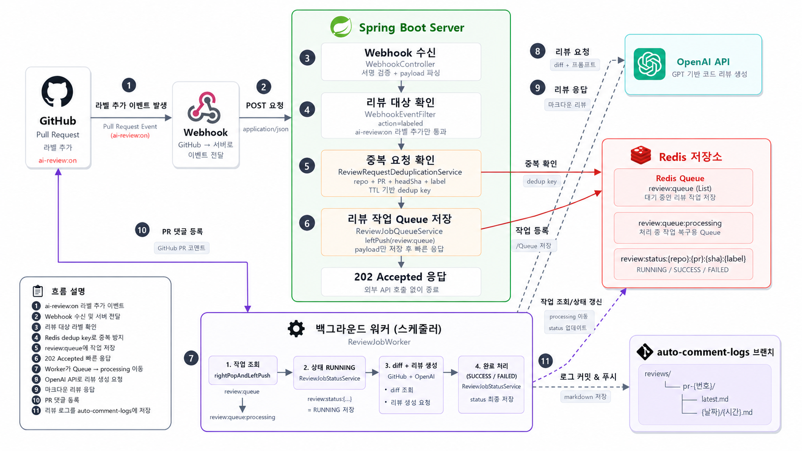

# Auto Comment 🤖
GitHub PR 이벤트 기반 GPT 자동 코드 리뷰 & 로그 시스템

---

## 🔥 프로젝트 소개
GitHub Pull Request 이벤트를 감지하여 변경된 diff를 분석하고,
GPT 기반 코드 리뷰를 자동 생성해 PR 댓글과 리뷰 로그로 저장하는 **백엔드 자동화 시스템**입니다.
리뷰는 PR에 `ai-review:on` 라벨이 추가되었을 때 실행됩니다.

- 코드 변경 분석
- AI 리뷰 생성
- GitHub 기록 저장

---

<h2>🎥 시연 영상 (Click!)</h2>

<a href="https://www.youtube.com/watch?v=cbiBKiDv5WE" target="_blank">
  
</a>

---

## 🚀 주요 기능
- 🔔 GitHub Webhook 기반 PR 이벤트 수신
- 🏷️ `ai-review:on` 라벨 추가 이벤트 감지 및 리뷰 트리거
- 🔍 변경된 코드(diff) 분석
- 🤖 GPT 기반 코드 리뷰 자동 생성
- 💬 PR 댓글 자동 등록
- 📝 리뷰 로그 파일 자동 저장
- 🔐 GitHub Webhook Signature 검증
- 🚫 Redis 기반 중복 리뷰 요청 방지
- 📥 Redis Queue 기반 리뷰 작업 처리
- 📊 리뷰 작업 상태 관리 (진행중 / 성공 / 실패)
- 🔁 GitHub / OpenAI API 응답 실패 시 재시도

---

## 🛠 기술 스택

### **Backend**
  
  
### **API**
  
  
### **Integration**
  
### **Networking**
  
### Database / Cache


---

## 🧩 시스템 구조


### Redis Queue 적용 후 구조



Redis Queue 적용 후에는 webhook 요청을 받은 즉시 리뷰를 수행하지 않는다.
`ai-review:on` 라벨이 추가된 PR만 리뷰 대상으로 판단하고, 중복 요청을 Redis에서 먼저 확인한 뒤 Queue에 작업을 저장한다.
실제 diff 조회, GPT 리뷰 생성, 댓글 등록, 리뷰 파일 저장은 `ReviewJobWorker`가 Queue에서 작업을 꺼내 별도 흐름으로 처리한다.

1) diff 분석<br><br><br>
2) GPT 요청
3) 리뷰 생성
4) GitHub 댓글 등록<br><br><br>
5) 로그 파일 저장<br>
<br><br>
<br><br>
- 이벤트 타입별 분기 처리 구조
- PR 단위 상태 관리

---

## 👨‍💻 리뷰 저장 구조
- 브랜치: `auto-comment-logs`
- 경로: `reviews/`<br>
  &emsp;&emsp;&emsp;&emsp;&emsp;└── `pr-{번호}/`<br>
  &emsp;&emsp;&emsp;&emsp;&emsp;&emsp;&emsp;&emsp;&emsp;&emsp;├── `latest.md`<br>
  &emsp;&emsp;&emsp;&emsp;&emsp;&emsp;&emsp;&emsp;&emsp;&emsp;└── `{날짜}/{시간}.md`<br>


- 최신 리뷰 + 히스토리 동시 관리

---

## ⚡ 트러블슈팅

### 🔍 문제 상황

GitHub Webhook을 통해 Pull Request 이벤트를 수신하고,
`ai-review:on` 라벨이 추가된 PR에 대해 자동으로 리뷰를 생성하는 기능을 구현했다.

초기 구조에서는 webhook 요청을 처리하는 과정에서 다음 작업을 **동기적으로 순차 실행**했다.

* GitHub API를 통한 PR diff 조회
* OpenAI API를 통한 코드 리뷰 생성
* GitHub PR 댓글 등록
* 리뷰 결과 파일 저장 (GitHub Repository)

즉, 하나의 요청 흐름에서 모든 외부 API 호출이 수행되는 구조이다.

---

### ⚠️ 무슨 문제가 생길 수 있을지 고민

* OpenAI API 호출의 응답 시간이 길어질 수도 있어서 전체 응답시간이 길어질 수 있음
* GitHub API가 여러 번 호출되며 네트워크 지연이 발생할 수 있음

GitHub Docs에 따르면 GitHub Webhook은 **10초 이내에 2XX 응답을 반환해야 안정적으로 처리**된다고 한다.
(https://docs.github.com/en/webhooks/using-webhooks/best-practices-for-using-webhooks#respond-within-10-seconds)

따라서, 현재 구조는 webhook delivery 실패 가능성이 있다.

---

### 🧠 원인 분석

예상되는 병목의 원인을 찾아보았다.

현재 `review()` 메서드가 실행되면, 하나의 요청 안에서 여러 외부 API 호출이 순차적으로 수행된다.

- `githubDiffService.getPullRequestDiff(...)`
  - GitHub REST API를 호출하여 PR diff 조회
- `gptReviewService.generateReview(diff)`
  - OpenAI API를 호출하여 리뷰 생성
- `githubCommentService.createComment(...)`
  - GitHub PR 댓글 등록 (POST)
- `githubFileService.saveReviewFile(...)`
  - GitHub Repository에 리뷰 파일 저장 (POST)

`review()` 내부에서

    **diff 조회 → OpenAI 호출 → 댓글 등록 → 파일 저장**

과정이 하나의 요청 스레드에서 순차적으로 실행되고 있다.

이로 인해:
- 외부 API 응답 속도에 따라 전체 처리 시간이 쉽게 늘어날 수 있다는 문제
- 현재 구조상 하나의 API라도 지연되면 다음 작업들은 모두 대기
- webhook 응답 지연 가능성 발생

따라서, **외부 API 성능**에 영향을 받음.

---

### 🛠 해결 방법

문제를 해결하기 위해 `비동기 처리`와`병렬 처리`를 도입하였다.

- 비동기: webhook 요청에 대해 10초 안에 2xx으로 응답하기 위해 사용
- 병렬처리: PR 리뷰 등록 및 저장을 독립적으로 실행하기 위해 사용 (작업 처리 시간 단축)

---

### 🔁 개선 구조

#### 기존 구조 (동기)
```
Webhook 요청 → diff 조회 → OpenAI 호출 → 댓글 등록 → 리뷰 저장 → 응답
```
---
#### 개선 구조 (비동기 + 병렬 처리)
```
Webhook 요청 → 이벤트 검증 → 202 Accepted 응답
                                ↓
                           reviewAsync()
                                ↓
                    diff 조회 → OpenAI 호출
                                ↓
               ┌──────── 댓글 등록
               └──────── 리뷰 파일 저장
```

#### 현재 개선 구조 (Redis Queue + 중복 방지 + 상태 관리)
```
Webhook 요청
     ↓
GitHub Signature 검증
     ↓
ai-review:on 라벨 이벤트 확인
     ↓
Redis 중복 요청 확인
     ↓
Redis Queue 저장
     ↓
202 Accepted 응답

     이후 별도 작업 흐름

ReviewJobWorker
     ↓
Redis Queue에서 작업 조회
     ↓
작업 상태 RUNNING 저장
     ↓
diff 조회 → OpenAI 리뷰 생성
     ↓
┌──────── GitHub 댓글 등록
└──────── 리뷰 파일 저장
     ↓
작업 상태 SUCCESS / FAILED 저장
```

Redis를 적용하면서 webhook 요청 흐름은 작업을 큐에 넣고 빠르게 응답하는 역할만 담당하도록 분리하였다.
이때 리뷰 대상은 PR에 추가된 라벨이 `ai-review:on`인지 확인해서 판단한다.
실제 리뷰 생성은 `ReviewJobWorker`가 Redis Queue에서 작업을 꺼내 처리한다.

이 구조를 통해 중복 webhook 요청을 막고, 리뷰 작업의 진행 상태를 Redis에 저장할 수 있게 되었다.


## ⚙️구현 방식:

1. 비동기 처리 (초기 개선)
   - WebhookController는 이벤트 검증 후 AsyncReviewService.reviewAsync()를 호출하고 즉시 응답 반환
   - Spring의 @Async를 사용하여 리뷰 파이프라인을 별도 스레드에서 실행
   - 전용 ThreadPoolTaskExecutor를 구성하여 비동기 작업 관리

    → webhook 응답 경로에서 외부 API 호출을 제거

현재는 이 구조를 Redis Queue 기반으로 한 번 더 개선하였다.
WebhookController는 리뷰 작업을 Redis Queue에 저장하고, ReviewJobWorker가 별도 흐름에서 작업을 처리한다.

---

2. 병렬 처리

- GitHub 댓글 등록
- 리뷰 파일 저장

동일한 리뷰 데이터를 기반이지만, 서로 의존하지 않기 때문에 `CompletableFuture`를 활용하여 병렬 실행하도록 구현하였다.

```
// 두 작업을 동시에 실행하고
CompletableFuture<Void> commentFuture = commentAsync(...);
CompletableFuture<Void> saveFuture = saveAsync(...);

// 모두 완료될 때까지 대기
CompletableFuture.allOf(commentFuture, saveFuture).join();
```

---

3. Redis 기반 작업 안정화

- `ReviewJobQueueService`
  - webhook에서 검증된 리뷰 작업을 Redis Queue에 저장
  - 작업 처리 전 `review:queue`에서 `review:queue:processing`으로 이동
  - 작업 완료 후 processing queue에서 제거

- `ReviewJobWorker`
  - Redis Queue를 주기적으로 확인하여 리뷰 작업 실행
  - 서버 재시작 시 processing queue에 남아 있던 작업을 다시 queue로 복구

- `ReviewRequestDeduplicationService`
  - 같은 PR, 같은 commit(headSha), 같은 label 요청이 반복될 경우 중복 처리 방지
  - 라벨 이름까지 key에 포함하여 같은 커밋이라도 서로 다른 리뷰 트리거를 구분할 수 있도록 구성
  - TTL을 사용하여 중복 방지 데이터가 영구적으로 쌓이지 않도록 관리

- `ReviewJobStatusService`
  - 리뷰 작업 상태를 `RUNNING`, `SUCCESS`, `FAILED`로 Redis에 저장
  - 실패 시 에러 메시지도 함께 저장

---

4. 안정성 개선

- RestClient connect/read timeout 설정
- GitHub / OpenAI API 응답 실패 시 재시도
- GitHub webhook signature 검증
- 댓글 등록과 리뷰 파일 저장의 부분 성공/실패 결과 기록

---

### ✅ 개선 결과

* webhook 요청 처리 시 즉시 응답이 가능하도록 구조 개선 
* 외부 API 지연이 webhook 처리 성공 여부에 영향을 주지 않도록 분리
* 댓글 등록 및 파일 저장 작업을 병렬화하여 **전체 처리 시간 단축**
* Redis Queue를 사용하여 webhook 응답과 리뷰 작업 처리를 분리
* Redis TTL을 사용하여 중복 요청 정보와 작업 상태 정보를 짧은 수명의 데이터로 관리
* API 응답 지연이나 일시적 실패에 대비하기 위해 timeout과 retry 정책 추가

---

## ⚠️ 한계 및 추가 개선 사항

- ~~비동기 작업 실패 시 작업 상태 추적 구조 필요~~
  - Redis를 사용하여 `RUNNING`, `SUCCESS`, `FAILED` 상태를 저장하도록 개선
- ~~중복 webhook 처리 방지 미구현~~
  - Redis TTL 기반으로 같은 PR, 같은 commit(headSha), 같은 label 요청을 중복 처리하지 않도록 개선

→ Redis는 짧은 수명의 중복 방지, 작업 큐, 상태 관리에 사용하고 DB는 장기 이력 저장에 사용하는 구조로 확장할 수 있을까?

- Redis: 
  - webhook 중복 요청 방지
  - 작업 큐 관리
  - 짧은 수명의 상태값 저장

  
- DB:
  - 작업 이력 저장
  - 성공 / 실패 상태 관리
  - 리뷰 생성 결과 및 로그 조회

### 새로 남은 개선 사항

- 실패한 리뷰 작업을 다시 Redis Queue에 넣는 job retry 구조
- 재시도 횟수를 초과한 작업을 별도로 보관하는 dead-letter queue 구조
- Redis에 저장한 작업 상태를 조회할 수 있는 API
- 장기적인 작업 이력과 리뷰 결과 조회를 위한 DB 저장 구조

---

## Redis 중복 리뷰 요청 방지

### Redis를 사용하기 위해 추가한 항목

1. Redis 연결 설정 추가
   - Spring Boot Redis 의존성과 `spring.data.redis` 설정을 추가하여 Redis를 사용할 수 있도록 구성

2. 중복 리뷰 요청 방지
   - 같은 PR, 같은 commit(headSha), 같은 label 요청이 반복될 경우 Redis key로 중복 처리 방지
   - 현재 리뷰 트리거 라벨은 `ai-review:on`

3. 리뷰 작업 상태 관리
   - Redis에 리뷰 작업 상태를 `RUNNING`, `SUCCESS`, `FAILED`로 저장

4. 리뷰 작업 Queue 처리
   - webhook 요청은 Redis Queue에 작업만 저장하고 빠르게 응답
   - `ReviewJobWorker`가 Queue에서 작업을 꺼내 실제 리뷰 생성 처리

5. 처리 중 작업 복구
   - 서버 재시작 시 `processing queue`에 남아 있던 작업을 다시 대기 Queue로 복구

6. 남은 개선 사항
   - 실패 작업 재시도 로직
   - 재시도 횟수를 초과한 작업을 보관하는 dead-letter queue 구조

---

### 문제 상황

GitHub Webhook은 네트워크 문제나 응답 지연 상황에서 동일 이벤트가 다시 전달될 수 있다.

따라서 중복 요청을 막지 않으면 같은 PR, 같은 commit에 대해 리뷰 생성 로직이 여러 번 실행될 수 있다.

```
Webhook 수신
     ↓
  리뷰 생성

  (재전송)

Webhook 수신
     ↓
  리뷰 생성
```

---

### 해결 방법

Redis를 이용하여 이미 처리 중인 리뷰 요청을 저장하였다.
같은 PR, 같은 commit, 같은 label 요청이 다시 들어오면 중복 요청으로 판단하고 리뷰 작업을 새로 만들지 않는다.

```
(Key 예시)
review:dedup:{repo}:{prNumber}:{headSha}:{label}

(예시)
review:dedup:hamplz/autocomment:21:abc123:ai-review:on

```


---

### 왜 headSha를 사용했는가?

PR 번호만 기준으로 중복 요청을 막으면 다음 상황을 처리할 수 없다.

```
PR #21
↓
리뷰 완료
↓
새 커밋 Push
↓
다시 리뷰 필요
```

하지만, `review:dedup:{repo}:21`처럼 PR 번호만 사용하면 새로운 커밋이 push되어도 같은 PR이라는 이유로 중복 요청으로 처리된다.

따라서, Redis key에 `headSha`를 포함하여

```
같은 커밋 → 중복 방지
새로운 커밋 → 리뷰 허용
```

구조를 만들었다.

---

### TTL을 사용한 이유

중복 방지 정보는 영구적으로 저장할 필요가 없다.
리뷰 요청의 중복 여부는 일정 시간 동안만 의미가 있고, 오래된 key가 계속 남아 있으면 Redis 메모리만 차지하게 된다.

따라서, Redis TTL을 사용하여 일정 시간이 지나면 자동 삭제되도록 구성하였다.

- 불필요한 데이터 누적 방지
- 짧은 수명의 상태 데이터 관리
- Redis 메모리 효율성 확보

---

## 💡 배운 점
- webhook과 같은 외부 시스템은 응답 시간 제약을 고려한 설계가 필수적이라는 점을 이해했다.
- 네트워크 I/O 대기 시간으로 인해 요청 스레드가 블로킹되며 전체 처리 시간이 증가하는 병목 구조를 경험했다.
- 비동기와 병렬 처리는 서로 다른 개념이며, 적절히 조합할 수 있다는 것을 알게되었다.

→ Blocking 과 Non-Blocking에 대해서도 공부해야겠다.

---
## ▶ 실행 방법

### 1) 환경 변수 설정
- `OPENAI_API_KEY`
- `GITHUB_TOKEN`
  - 권한
    - Pull Requests: Read and Write
    - Contents: Read and Write

### 2) ngrok 연결
```
ngrok http 8080
```
### 3) Redis 실행
```
docker run -d --name redis -p 6379:6379 redis
```

### 4) 애플리케이션 실행
```bash
./gradlew bootRun
```

---
