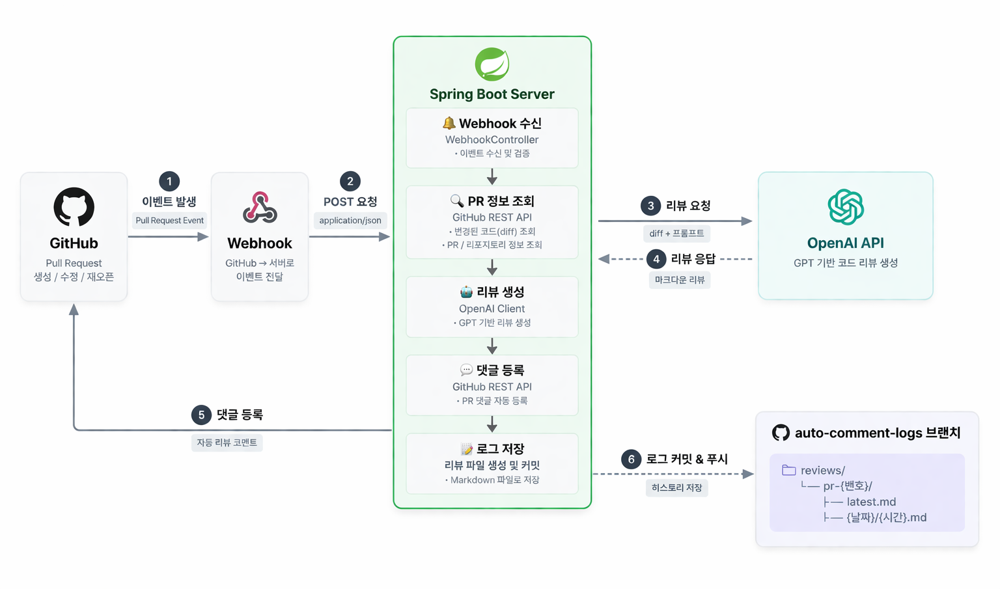
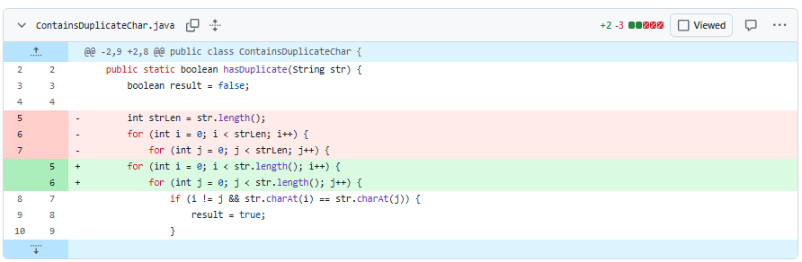
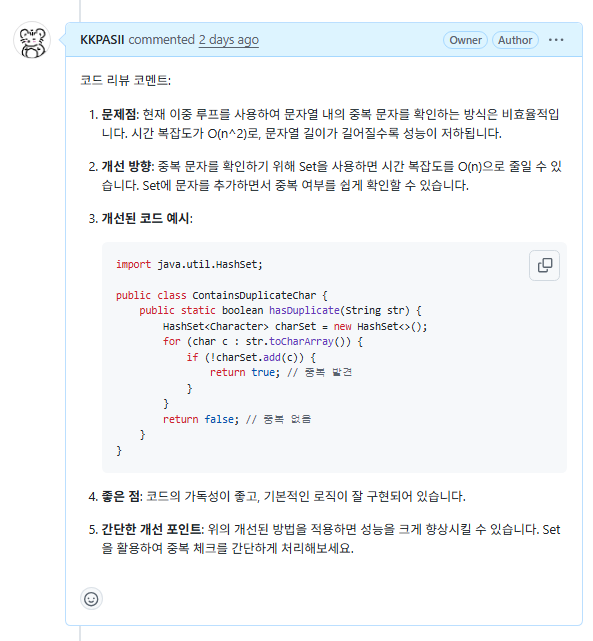
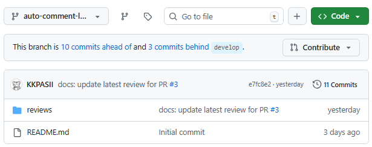
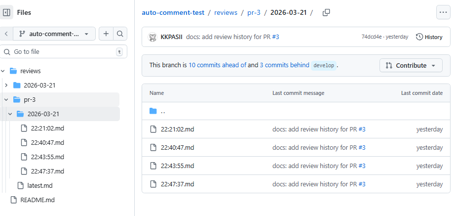

# Auto Comment 🤖
GitHub PR 이벤트 기반 GPT 자동 코드 리뷰 & 로그 시스템

## 🔥 프로젝트 소개
GitHub Pull Request 이벤트를 감지하여 변경된 diff를 분석하고,
GPT 기반 코드 리뷰를 자동 생성해 PR 댓글과 리뷰 로그로 저장하는 **백엔드 자동화 시스템**입니다.

- 코드 변경 분석
- AI 리뷰 생성
- GitHub 기록 저장

🎥 시연 영상 (링크: https://www.youtube.com/watch?v=cbiBKiDv5WE) <br><br>
[](https://youtu.be/cbiBKiDv5WE)

---

## 🚀 주요 기능
- 🔔 GitHub Webhook 기반 PR 이벤트 수신
- 📌 PR 생성 / 수정 / 재오픈 이벤트 감지
- 🔍 변경된 코드(diff) 분석
- 🤖 GPT 기반 코드 리뷰 자동 생성
- 💬 PR 댓글 자동 등록
- 📝 리뷰 로그 파일 자동 저장

---

## 🛠 기술 스택
- **Backend**: Java 21, Spring Boot
- **API**: OpenAI API, GitHub REST API
- **Integration**: GitHub Webhook
- **Networking**: ngrok
- **Client**: RestClient
- **Format**: Markdown

---

## 🧩 시스템 구조



1) diff 분석<br><br><br>
2) GPT 요청
3) 리뷰 생성
4) GitHub 댓글 등록<br><br><br>
5) 로그 파일 저장<br>
<br><br>
<br><br>
- 이벤트 타입별 분기 처리 구조
- PR 단위 상태 관리

---

## 👨‍💻 리뷰 저장 구조
- 브랜치: `auto-comment-logs`
- 경로: `reviews/`<br>
  &emsp;&emsp;&emsp;&emsp;&emsp;└── `pr-{번호}/`<br>
  &emsp;&emsp;&emsp;&emsp;&emsp;&emsp;&emsp;&emsp;&emsp;&emsp;├── `latest.md`<br>
  &emsp;&emsp;&emsp;&emsp;&emsp;&emsp;&emsp;&emsp;&emsp;&emsp;└── `{날짜}/{시간}.md`<br>


- 최신 리뷰 + 히스토리 동시 관리

---

## ⚡ 트러블슈팅

### 1. Webhook 이벤트 payload 구조를 바로 사용하기 어려웠던 문제

- **문제**
  GitHub Webhook으로 전달되는 Pull Request 이벤트 payload는 구조가 깊고 필드가 많아서,
  처음에는 필요한 값(PR 번호, action, repository 정보 등)을 한 번에 다루기 어려웠습니다.
  특히 어떤 필드가 실제로 필요한지 명확하지 않아 파싱 로직이 불안정했습니다.

- **무엇을 했는가**
  처음에는 payload 전체를 한 번에 처리하려고 했지만,
  실제로는 필요한 값이 제한적이라는 것을 확인했습니다.
  그래서 webhook 요청 본문 전체를 로그로 찍어 구조를 확인한 뒤,
  자주 사용하는 필드만 DTO로 분리했습니다.

  예를 들어:
  - `action`
  - `pull_request.number`
  - `pull_request.diff_url`
  - `repository.full_name`

  이런 값만 우선 추출하도록 구조를 단순화했습니다.

- **결과**
  이벤트 처리 로직이 훨씬 명확해졌고,
  PR 생성 / 수정 / 재오픈 이벤트에 대해 필요한 데이터만 안정적으로 처리할 수 있게 되었습니다.

- **배운 점**
  외부 API 연동에서는 문서만 보는 것보다
  **실제 요청 데이터를 먼저 확인하고 필요한 필드만 명확히 추려내는 방식**이 더 안정적이라는 것을 배웠습니다.

---

### 2. 같은 PR 이벤트가 중복 처리되던 문제

- **문제**
  Pull Request가 synchronize 되거나 여러 번 갱신될 때,
  동일한 PR에 대해 리뷰 생성 로직이 반복 실행되는 문제가 있었습니다.
  그 결과 같은 내용의 코멘트가 여러 번 달리거나,
  로그 파일이 불필요하게 중복 저장될 가능성이 있었습니다.

- **무엇을 했는가**
  모든 webhook 이벤트를 처리하지 않고,
  실제로 자동 리뷰가 필요한 action만 선별하도록 조건문을 추가했습니다.
  예를 들어:
  - `opened`
  - `synchronize`
  - `reopened`

  만 처리하고,
  리뷰 저장 브랜치 관련 이벤트나 필요 없는 이벤트는 무시하도록 분기했습니다.

  또한 PR 번호와 action 기준으로 처리 흐름을 구분해
  불필요한 중복 실행을 줄였습니다.

- **결과**
  자동 리뷰가 필요한 시점에만 동작하게 되었고,
  중복 댓글 등록과 불필요한 로그 저장 가능성을 낮출 수 있었습니다.

- **배운 점**
  이벤트 기반 시스템에서는
  “요청이 오면 일단 처리”가 아니라,
  **어떤 이벤트만 처리할 것인지 명확하게 제한하는 설계**가 중요하다는 것을 배웠습니다.

---

### 3. GitHub 댓글 등록은 되는데 로그 파일 저장은 403이 발생하던 문제

- **문제**
  GitHub API를 이용해 PR 댓글 등록은 성공했지만,
  `auto-comment-logs` 브랜치에 리뷰 로그 파일을 저장하는 요청에서는 403 Forbidden 에러가 발생했습니다.

- **어디를 수정했는가**
  - GitHub 토큰 설정
  - GitHub API 호출 클래스(예: `GitHubClient.java`)
  - 환경 변수 설정

- **무엇을 했는가**
  처음에는 같은 토큰으로 댓글도 작성되기 때문에
  파일 저장도 가능할 것이라고 생각했습니다.
  하지만 GitHub Fine-grained token은 기능별 권한이 분리되어 있다는 점을 확인했습니다.

  그래서 토큰 권한을 다시 점검했고,
  `Contents: Read and Write` 권한을 추가한 뒤
  파일 생성/수정 API 호출이 가능하도록 설정했습니다.

- **결과**
  PR 댓글 등록뿐 아니라,
  리뷰 결과를 `latest.md` 및 날짜별 히스토리 파일로 정상 저장할 수 있게 되었습니다.

- **배운 점**
  GitHub API는 같은 저장소에 접근하더라도
  작업 종류에 따라 필요한 권한이 다르기 때문에,
  **기능 단위로 권한을 확인하는 습관**이 중요하다는 것을 배웠습니다.

---

### 4. 리뷰 로그를 저장한 브랜치 때문에 webhook이 다시 발생하던 문제

- **문제**
  자동 리뷰 결과를 `auto-comment-logs` 브랜치에 커밋하도록 구현한 뒤,
  해당 브랜치에서 발생한 변경도 다시 webhook 이벤트로 전달되어
  시스템이 자기 자신을 다시 호출하는 구조가 생겼습니다.

- **무엇을 했는가**
  webhook payload에 포함된 브랜치 정보나 PR 대상 정보를 확인해서,
  로그 저장용 브랜치와 관련된 이벤트는 자동 리뷰 처리 대상에서 제외하도록 조건을 추가했습니다.

  즉,
  - 리뷰 대상 PR 이벤트만 처리
  - 로그 저장 브랜치 관련 이벤트는 무시

  하도록 분리했습니다.

- **결과**
  리뷰를 저장해도 webhook이 다시 자기 자신을 호출하지 않게 되었고,
  무한 루프 가능성을 제거할 수 있었습니다.

- **배운 점**
  자동화 시스템은 편리하지만,
  잘못 설계하면 **자기 자신을 다시 트리거하는 loop 구조**가 생길 수 있기 때문에
  입력 이벤트를 명확히 제한해야 한다는 점을 배웠습니다.

---
## ▶ 실행 방법

### 1) 환경 변수 설정
- `OPENAI_API_KEY`
- `GITHUB_TOKEN`
  - 권한
    - Pull Requests: Read and Write
    - Contents: Read and Write

### 2) ngrok 연결
```
ngrok http 8080
```

### 3) 애플리케이션 실행
```bash
./gradlew bootRun
```

---

## 📌 향후 개선
- DB 기반 로그 관리 (현재: 파일 기반)
- GitHub App 형태로 확장
- 리뷰 품질 개선 (프롬프트 고도화)

---