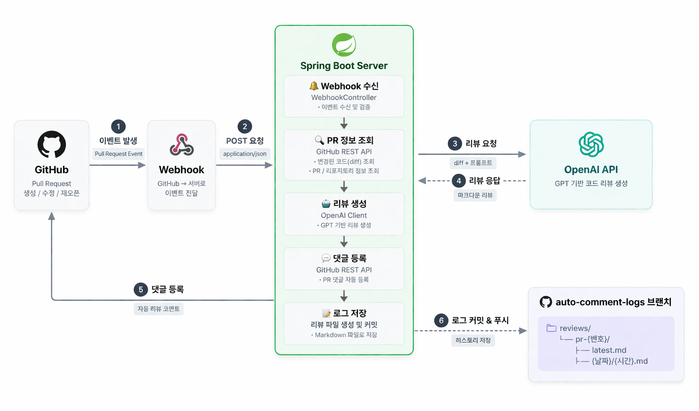
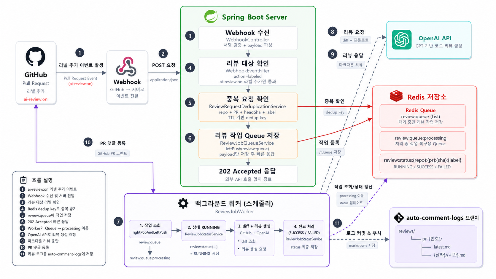
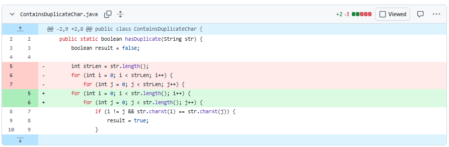
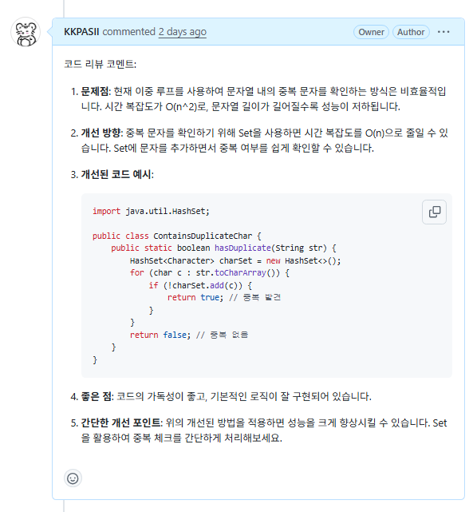

# Auto Comment 🤖

GitHub PR 이벤트 기반 GPT 자동 코드 리뷰 & 로그 시스템

---

## 🔥 프로젝트 소개
GitHub Pull Request 이벤트를 감지하여 변경된 diff를 분석하고,
GPT 기반 코드 리뷰를 자동 생성해 **PR 댓글과 리뷰 로그로 저장하는 백엔드 자동화 시스템**입니다.

PR에 `ai-review:on` 라벨이 추가되면 리뷰 작업을 생성하며,
Webhook 요청과 실제 리뷰 작업을 Redis Queue로 분리하여 외부 API 응답 지연이 Webhook 처리에 직접 영향을 주지 않도록 구성했습니다.

또한 GitHub / OpenAI와 같은 외부 시스템 연동 과정에서 발생할 수 있는
**중복 요청, 일시적 API 실패, 부분 실패, 서버 중단 상황**을 고려해 안정성을 개선했습니다.

---

<h2>🎥 시연 영상 (Click!)</h2>

<a href="https://www.youtube.com/watch?v=cbiBKiDv5WE" target="_blank">
  
</a>

---

## 🚀 주요 기능

- 🔔 GitHub Webhook 기반 PR 리뷰 자동화
- 🤖 PR diff 분석 및 GPT 코드 리뷰 생성
- 💬 PR 댓글 및 리뷰 로그 자동 저장
- 📥 Redis Queue 기반 리뷰 작업 분리 및 중복 요청 방지
- 🔐 Webhook 검증, API Retry, 부분 실패 대응을 통한 외부 연동 안정화

---

## 🛠 기술 스택

### **Backend**
  
  

### **API**
  
  

### **Integration**
  

### **Data / Queue**


### **Networking**
  

---

## 🧩 시스템 구조



### Redis Queue 적용 후 구조



### 현재 구조

```text
GitHub Webhook
      ↓
HMAC Signature 검증
      ↓
X-GitHub-Event / 리뷰 대상 이벤트 확인
      ↓
Redis 중복 요청 확인
      ↓
Redis Queue에 Review Job 저장
      ↓
202 Accepted
      ↓
Webhook 요청 종료

----------------------------

ReviewJobWorker
      ↓
review:queue
      ↓
review:queue:processing
      ↓
RUNNING
      ↓
GitHub API - PR diff 조회
      ↓
OpenAI API - 코드 리뷰 생성
      ↓
┌─────────────────┬─────────────────┐
│ PR 댓글 등록     │ 리뷰 파일 저장    │
└─────────────────┴─────────────────┘
                            ↓
                       History 저장
                            ↓
                      latest.md 저장
                            ↓
                  부분 실패 시 실패 Task Retry
                            ↓
              SUCCESS / PARTIAL_FAILED / FAILED
```

전체 처리 과정은 다음과 같습니다.

1. `ai-review:on` 라벨이 추가된 PR Webhook 수신
2. HMAC Signature와 GitHub 이벤트 종류 검증
3. 리뷰 대상 이벤트 및 브랜치 확인
4. Redis key를 이용한 중복 요청 방지
5. 리뷰에 필요한 Job 정보를 Redis Queue에 저장
6. 실제 리뷰 완료를 기다리지 않고 `202 Accepted` 반환
7. `ReviewJobWorker`가 Queue의 Job을 Processing Queue로 이동
8. GitHub API를 통해 PR diff 조회<br><br><br>
9. OpenAI API를 통해 리뷰 생성
10. PR 댓글 등록과 리뷰 파일 저장 병렬 처리<br><br><br>
11. 리뷰 파일 저장 내부에서는 같은 브랜치에 대한 동시 Write 충돌을 방지하기 위해 History → latest.md 순서로 저장
12. 부분 실패 발생 시 실패한 작업만 선택적으로 재시도
13. 최종 처리 결과를 Redis에 상태로 저장

Webhook 요청을 처리하는 Thread는 외부 API 호출이 끝날 때까지 기다리지 않고
Redis에 Job을 정상적으로 저장한 뒤 종료됩니다.

실제 외부 API 호출은 별도의 Worker 흐름에서 수행됩니다.

---

## 👨‍💻 리뷰 저장 구조

리뷰 결과는 `auto-comment-logs` 브랜치에 저장합니다.

```text
reviews/
└── pr-{PR 번호}/
    ├── latest.md
    └── {날짜}/
        └── {시간}.md
```

- `latest.md`
    - 해당 PR의 가장 최근 리뷰 저장
- `{날짜}/{시간}.md`
    - 리뷰 실행 시점별 History 보관

두 파일은 서로 다른 경로에 저장되지만, 모두 동일한 `auto-comment-logs` 브랜치에 Write하는 작업입니다.

GitHub Contents API를 이용한 두 저장 작업을 병렬로 수행하면 한 작업이 먼저 브랜치를 갱신한 뒤
다른 작업이 이전 브랜치 상태를 기준으로 저장을 시도하면서 `409 Conflict`가 발생할 수 있습니다.

따라서 리뷰 파일은 다음 순서로 저장합니다.

```text
History 저장
   ↓
latest.md 저장
```

외부 API 단위 Retry와 별개로, 일부 저장 작업이 실패한 경우에는 성공한 작업을 다시 수행하지 않고
실패한 Task만 선택적으로 재시도합니다.

---

# ⚡ 트러블슈팅

## 1. Webhook 요청에서 외부 API를 직접 호출하던 문제

### 🔍 문제 상황

초기 구조에서는 **하나의 Webhook 요청** 안에서 다음 **작업을 순차적**으로 수행했습니다.

```text
Webhook 요청
    ↓
GitHub diff 조회
    ↓
OpenAI 리뷰 생성
    ↓
GitHub 댓글 등록
    ↓
리뷰 파일 저장
    ↓
Webhook 응답
```

GitHub / OpenAI API는 네트워크 I/O가 포함된 외부 시스템이기 때문에
응답이 지연되면 Webhook 요청 Thread 역시 외부 API 응답을 기다리며 계속 점유됩니다.

GitHub Docs에 따르면 GitHub Webhook은 서버가 **10초 이내에 2XX 응답을 반환**할 것을 권장합니다.
(https://docs.github.com/en/webhooks/using-webhooks/best-practices-for-using-webhooks#respond-within-10-seconds)
응답이 지나치게 늦으면 Delivery 처리에 문제가 발생할 수 있습니다.

- OpenAI 응답 지연에 따라 Webhook 응답 시간 증가
- 하나의 외부 API가 지연되면 뒤의 작업도 모두 대기
- 동시에 여러 Webhook이 들어올 경우 요청 Thread가 장시간 점유될 가능성
- GitHub Webhook의 빠른 응답 요구사항을 만족하지 못할 가능성

### 🧠 원인

Webhook 요청 처리와 실제 리뷰 작업의 생명주기가 분리되지 않은 것이 원인이었습니다.

```text
HTTP 요청 Thread
    ↓
Diff 조회
    ↓
OpenAI
    ↓
GitHub 저장
    ↓
응답
```

외부 API 호출이 모두 끝나야 HTTP 요청 Thread가 반환되는 구조였습니다.

### 해결

Webhook 요청 처리와 실제 리뷰 실행을 **Redis Queue를 이용해 분리**했습니다.

```text
Webhook Thread

요청 검증
   ↓
Redis Queue에 Job 저장
   ↓
202 Accepted
   ↓
Thread 반환


ReviewJobWorker

Redis Queue에서 Job 조회
   ↓
GitHub / OpenAI API 호출
   ↓
리뷰 결과 처리
```

Redis I/O 자체를 Non-Blocking으로 구현한 것은 아닙니다.

대신 시간이 오래 걸리는 Blocking 외부 API 작업을
**HTTP 요청 처리 경로에서 분리**하여 Webhook 요청 Thread가 외부 API 응답을 기다리지 않도록 했습니다.

현재 Worker는 Review Job 하나를 완료한 뒤 다음 Job을 처리하는 순차 소비 방식이지만,
 Worker가 Job을 처리하는 동안에도 새로운 Webhook 요청은 Redis Queue에 계속 저장할 수 있습니다.

### ✅ 결과

- Webhook 요청은 실제 리뷰 완료를 기다리지 않고 `202 Accepted` 반환
- 외부 API 응답 시간이 Webhook 응답 시간에 직접 포함되지 않도록 분리
- 순간적으로 여러 요청이 들어와도 Redis Queue에 작업을 적재할 수 있는 구조로 개선
- 외부 API의 Blocking I/O가 Webhook 요청 Thread를 장시간 점유하던 문제 개선

---

## 2. 서로 독립적인 외부 API 작업을 순차 처리하던 문제

🔍 문제 상황

PR diff 조회와 OpenAI 리뷰 생성은 의존 관계가 있습니다.

```text
PR diff
   ↓
OpenAI Review
```

OpenAI가 리뷰를 생성하려면 먼저 diff 결과가 필요하기 때문에 두 작업은 순차적으로 수행합니다.

반면 GPT 리뷰가 만들어진 이후의 다음 작업들은 서로 의존하지 않고 독립적입니다.

```text
             GPT Review
                 ↓
        ┌────────┴────────┐
        │                 │
    PR Comment        Review File
```

초기에는 이 독립적인 작업들까지 순차적으로 처리하고 있었습니다.

### 🧠 원인

작업 간 데이터 의존성을 구분하지 않고 전체 리뷰 파이프라인을 하나의 순차 흐름으로 구성했기 때문입니다.

```text
Comment 완료
    ↓
Review File 저장
```

두 작업이 서로의 결과를 필요로 하지 않음에도 앞 작업이 끝날 때까지 다음 작업이 기다리는 구조였습니다.

### 🛠 해결

`PR 댓글 등록`과 `리뷰 파일 저장`은 서로의 결과에 의존하지 않기 때문에
별도의 Executor에서 병렬 처리하도록 변경했습니다.

```text
             GPT Review
                 ↓
        ┌────────┴────────┐
        │                 │
    PR Comment        Review File
```

반면 리뷰 파일 저장 내부의 `History`와 `latest.md`는 서로 다른 파일을 저장하지만,
둘 다 같은 `auto-comment-logs` 브랜치에 Write하는 작업이므로 완전히 독립적인 작업은 아닙니다.

처음에는 두 작업도 병렬 처리했지만 실제 테스트 과정에서,
한 작업이 먼저 브랜치를 갱신하면 다른 작업이 이전 브랜치 상태를 기준으로 Write하면서
`409 Conflict`가 발생하는 race condition을 확인했습니다.

```text
Review File
    ↓
History 저장
    ↓
latest.md 저장
```

따라서 `History → latest.md` 순서로 저장하도록 변경했습니다.

### ✅ 결과

`PR 댓글 등록`과 `리뷰 파일 저장`은 병렬로 처리하므로
두 작업의 처리 시간이 단순히 합산되지 않고 더 오래 걸리는 작업의 완료 시간을 중심으로 기다리게 됩니다.

```text
max( Comment 처리 시간, ReviewFile 처리 시간 )
```

반면 같은 브랜치 상태를 변경하는 `History / latest.md`는 순차 처리하여
GitHub Contents API의 동시 Write 충돌을 방지했습니다.

별도의 성능 벤치마크를 수행하지 않아 정확한 감소율을 측정하지는 않았지만,
**독립적인 외부 I/O 작업만 병렬화하고 공유 상태를 변경하는 작업은 순차 처리하도록 병렬 처리 범위를 조정했습니다.**

---

## 3. 병렬 처리의 부분 실패 문제

### 🔍 문제 상황

후처리 작업의 실패 처리를 테스트하는 과정에서,
일부 작업이 실패했음에도 전체 Review Job이 `SUCCESS`로 처리되는 문제를 발견했습니다.

```text
PR Comment     SUCCESS
Review File    FAILED
```

리뷰 파일 저장 내부에서도 동일하게 부분 실패가 발생할 수 있습니다.

```text
History    SUCCESS
Latest     FAILED
```

기존 구조에서는 하위 작업에서 실패 결과를 반환하더라도
상위 계층에서 예외가 발생하지 않으면 전체 Review Job을 `SUCCESS`로 처리하고 있었습니다.

### 🧠 원인

병렬 작업의 성공 여부를 개별적으로 관리하지 않고,
상위 메서드가 정상적으로 반환됐는지만을 기준으로 전체 성공 여부를 판단했기 때문입니다.

즉:

```text
Comment       SUCCESS
ReviewFile    FAILED
                  ↓
상위 메서드는 정상 반환
                  ↓
Job SUCCESS ❌
```

즉, 병렬 작업 중 일부가 실패하더라도 그 결과가 상위 계층까지 명확하게 전달되지 않아
부분 실패를 전체 성공으로 판단할 수 있는 구조였습니다.

### 해결

각 후처리 작업의 실행 결과를 별도의 객체로 관리하고,
하위 작업의 성공/실패 정보를 상위 계층까지 전달하도록 변경했습니다.

```text
Comment / ReviewFile
        ↓
DispatchResult

History / Latest
        ↓
ReviewFileSaveResult
```

각 작업은 `DispatchTaskResult`를 통해 성공/실패 여부와 에러 정보를 반환합니다.

```java
DispatchResult dispatchResult = new DispatchResult(
    commentFuture.join(),
    saveReviewFuture.join()
);
```

이를 통해 각 후처리 작업의 결과를 확인한 뒤
전체 Review Job의 최종 상태를 판단할 수 있도록 했습니다.

또한 부분 실패가 발생하면 해당 처리 단계에서
실패한 작업만 선택적으로 재시도하도록 변경했습니다.

```text
1차 실행

Comment       SUCCESS
ReviewFile    FAILED

        ↓

재시도

Comment       실행하지 않음
ReviewFile    다시 실행
```

Review File 내부에서도 같은 방식을 적용했습니다.

```text
1차 실행

History    SUCCESS
Latest     FAILED

        ↓

재시도

History    실행하지 않음
Latest     다시 실행
```

따라서 동일 처리 단계에서는 이미 성공한 작업을 다시 수행하지 않고,
실패한 작업을 우선적으로 재시도할 수 있도록 구성했습니다.

### ✅ 결과

최종 처리 결과를 다음과 같이 구분할 수 있게 되었습니다.

```text
모든 작업 성공
→ SUCCESS

리뷰 생성은 완료했지만
후처리 일부가 Retry 후에도 실패
→ PARTIAL_FAILED

Diff 조회 / OpenAI 호출 등
Review Job 자체를 완료하지 못함
→ FAILED
```

이를 통해 다음과 같이 개선했습니다.

- 후처리 작업의 부분 실패를 명시적으로 식별
- 하위 작업의 성공/실패 결과를 상위 계층까지 전달
- 부분 실패 시 이미 성공한 작업은 유지하고, 실패한 작업만 재시도
- 전체 실패와 부분 실패를 상태 수준에서 구분

---

# ⚙️ 주요 구현 방식

## 1. Redis Queue

### ReviewJobQueueService

Webhook에서 검증된 리뷰 Job을 Redis List에 저장합니다.

```text
review:queue
```

Worker가 Job을 가져올 때 바로 삭제하지 않고:

```text
review:queue
       ↓
review:queue:processing
```

으로 이동합니다.

작업이 완료된 이후에 Processing Queue에서 제거합니다.

이를 통해 서버가 리뷰를 처리하는 중 종료되더라도
Job 자체가 즉시 사라지지 않도록 했습니다.

애플리케이션 재시작 시 Processing Queue에 남아 있던 Job을 다시 대기 Queue로 복구합니다.

---

## 2. Redis 기반 중복 요청 방지

GitHub Webhook은 동일 이벤트가 다시 전달될 수 있습니다.

같은 요청을 그대로 처리하면 동일 PR과 동일 Commit에 대해
OpenAI 리뷰가 여러 번 생성될 수 있습니다.

이를 방지하기 위해 다음 정보를 Redis key에 포함했습니다.

```text
review:dedup:{repo}:{prNumber}:{headSha}:{label}
```

예:

```text
review:dedup:hamplz/autocomment:21:abc123:ai-review:on
```

`headSha`를 포함한 이유는 같은 PR에도 새로운 Commit이 Push될 수 있기 때문입니다.

```text
같은 PR + 같은 Commit
→ 중복 요청으로 처리

같은 PR + 새로운 Commit
→ 새로운 리뷰 허용
```

중복 방지 정보는 영구 저장할 필요가 없기 때문에 TTL을 적용했습니다.

이를 통해:

- 불필요한 Redis 데이터 누적 방지
- 일정 시간 이후 동일 조건에 대한 재처리 허용
- 짧은 수명의 상태 데이터 관리

가 가능하도록 했습니다.

---

## 3. 작업 상태 관리

`ReviewJobStatusService`를 통해 Redis에 Review Job의 상태를 저장합니다.

```text
RUNNING
SUCCESS
PARTIAL_FAILED
FAILED
```

상태의 의미는 다음과 같습니다.

| 상태 | 의미 |
|---|---|
| `RUNNING` | Review Job 처리 중 |
| `SUCCESS` | 모든 작업이 정상적으로 완료됨 |
| `PARTIAL_FAILED` | 리뷰는 생성했지만 일부 후처리가 Retry 후에도 실패 |
| `FAILED` | diff 조회, OpenAI 호출 등 Job 자체가 완료되지 못함 |

실패한 경우 오류 정보도 함께 저장하며,
작업 상태 역시 영구적인 데이터가 아니기 때문에 TTL을 적용합니다.

---

## 4. 외부 API Retry

GitHub / OpenAI와 같은 외부 시스템은
일시적인 네트워크 장애나 서버 오류가 발생할 수 있습니다.

따라서 외부 API 호출에 다음 정책을 적용했습니다.

- Connect Timeout
- Read Timeout
- 최대 3회의 API Retry
- `429 Too Many Requests`
- `5xx Server Error`
- 네트워크 계층의 일시적 오류

API 단위 Retry가 모두 실패한 이후에도
후처리 단계에서는 실패한 Task만 한 번 더 선택적으로 수행합니다.

따라서 Retry 범위를 다음과 같이 구분하고 있습니다.

```text
API Retry
→ 하나의 외부 API 호출에 대한 재시도

Task Retry
→ Comment / ReviewFile / History / Latest 작업 단위 재시도

Job Retry
→ 전체 Review Job 재실행
→ 현재 미구현
```

---

## 5. Webhook 검증

외부에서 전달되는 Webhook 요청을 그대로 신뢰하지 않도록 다음 검증을 적용했습니다.

### HMAC Signature 검증

GitHub의 `X-Hub-Signature-256` Header와
Webhook Secret을 이용하여 HMAC-SHA256 Signature를 검증합니다.

Webhook Secret이 설정되지 않은 경우 요청을 통과시키지 않는
**fail-closed 방식**으로 구성했습니다.

### Event Header 검증

`X-GitHub-Event` Header를 확인하여
`pull_request` 이벤트만 리뷰 처리 대상으로 전달합니다.

이후 `WebhookEventFilter`에서:

- `action=labeled`
- `ai-review:on`
- 리뷰 로그 브랜치 제외

등 실제 리뷰 실행 조건을 추가로 확인합니다.

HMAC Signature는 요청의 출처와 Body의 무결성을 검증하고,
Event Header와 Payload Filter는 요청의 처리 대상 여부를 판단합니다.

---

# ✅ 개선 결과

초기 구조에서 현재 구조로 개선하면서 다음 문제를 해결했습니다.

| 구분 | 초기 구조 | 현재 구조 |
|---|---|---|
| Webhook 응답 처리 | GitHub / OpenAI 등 외부 API 작업이 모두 끝난 뒤 응답 | Redis Queue에 Job 저장 후 `202 Accepted` 반환 |
| 실제 리뷰 작업 실행 | Webhook 요청 Thread에서 직접 실행 | `ReviewJobWorker`가 Queue에서 Job을 가져와 별도 처리 |
| PR 댓글 등록 + 리뷰 파일 저장 | 두 작업을 순차 실행 | 서로 독립적인 작업으로 판단하여 병렬 실행 |
| History + latest.md 저장 | 두 파일 저장을 순차 실행 | 병렬화 시 동일 브랜치 Write 충돌 방지를 위해 순차 실행 |
| 후처리 작업 부분 실패 | 일부 실패해도 상위에서 전체 성공으로 판단할 가능성 존재 | 작업별 결과를 별도로 관리하여 부분 실패 식별 |
| 실패 작업 재시도 | 외부 API 호출 자체에 대한 Retry만 존재 | API Retry + 실패한 Comment / ReviewFile / History / Latest Task만 선택적으로 Retry |
| 처리 중 서버 종료 | 처리 중이던 Job이 유실될 가능성 존재 | Processing Queue에 보관하고 재시작 시 대기 Queue로 복구 |
| 작업 상태 관리 | `SUCCESS / FAILED` 중심 | `RUNNING / SUCCESS / PARTIAL_FAILED / FAILED`로 세분화 |


현재 외부 API 호출 자체는 `RestClient` 기반 Blocking I/O입니다.

즉, 시스템 전체를 Non-Blocking으로 변경한 것이 아니라
**시간이 오래 걸리는 Blocking 외부 API 작업을 Webhook 요청 처리 경로에서 분리하고,
하나의 Review Job 내부에서도 실제로 서로 독립적인 후처리 작업만 별도의 Executor를 통해 병렬 처리하도록 구성**했습니다.

현재 `ReviewJobWorker`는 Job을 하나씩 순차적으로 소비하며,
병렬 처리는 `Comment / ReviewFile`처럼 서로 독립적인 작업에만 적용합니다.

`History / latest.md` 저장은 같은 브랜치 상태를 변경하는 작업이므로
GitHub Contents API의 동시 Write 충돌을 방지하기 위해 순차적으로 처리합니다.

---

# ⚠️ 한계 및 추가 개선 사항

현재 구조에도 다음과 같은 한계가 있습니다.

### 1. Job-level Retry

GitHub Diff 조회 또는 OpenAI API 호출이
API Retry 이후에도 최종적으로 실패하면 Job은 `FAILED` 처리됩니다.

현재는 실패한 전체 Job을 Redis Queue에 다시 넣는 구조는 구현하지 않았습니다.

향후:

```text
FAILED
   ↓
Job Retry
   ↓
Retry 횟수 초과
   ↓
Dead Letter Queue
```

형태로 확장할 수 있습니다.

### 2. Worker 처리량

현재 `ReviewJobWorker`는 하나의 Job을 완료한 뒤
다음 Job을 가져오는 순차 소비 방식입니다.

순간적인 요청 증가는 Redis Queue가 완충할 수 있지만,
장기간:

```text
Job 유입량 > Worker 처리량
```

인 상황이 지속되면 Queue가 계속 증가할 수 있습니다.

향후 제한된 크기의 Worker Thread Pool을 이용해
여러 Review Job을 동시에 처리하도록 확장할 수 있습니다.

### 3. 외부 Side Effect의 멱등성

GitHub Comment와 같은 POST 요청은
서버에서는 성공했지만 응답을 받지 못한 상황에서 Retry하면
동일 댓글이 중복 생성될 가능성이 있습니다.

따라서 장기적으로는:

- 요청 식별자
- 기존 댓글 검색
- 동일 Comment Update
- 멱등성 Key

등을 이용해 중복 Side Effect를 방지할 필요가 있습니다.

### 4. Job / Review 장기 저장

현재 Redis는 다음과 같은 짧은 수명의 데이터에 사용합니다.

- 중복 요청 정보
- Review Job Queue
- Processing Queue
- 작업 상태

향후 RDB를 추가하면:

- 작업 이력
- 리뷰 결과
- 장기적인 성공 / 실패 기록
- 통계 및 조회 기능

을 영구적으로 관리할 수 있습니다.

### 5. GitHub Diff URL 검증

현재 Webhook Payload에서 전달받은 `diff_url`을 이용해 PR diff를 조회합니다.

향후에는 외부에서 전달받은 URL을 그대로 사용하는 대신
검증된 `repoFullName`과 `prNumber`를 이용해
신뢰 가능한 GitHub API Endpoint를 직접 구성하도록 개선할 수 있습니다.

---

# 💡 배운 점

- 초기에는 Webhook 요청 안에서 GitHub Diff 조회, OpenAI 리뷰 생성, 댓글 등록, 리뷰 파일 저장까지 모두 수행하여 외부 API 응답 시간이 Webhook 응답 시간에 그대로 포함되었습니다. 이를 Redis Queue 기반 구조로 변경해 Webhook에서는 Job 저장 후 `202 Accepted`를 반환하고, 실제 리뷰 작업은 Worker가 처리하도록 분리하여 **Webhook 요청 Thread가 외부 API 응답을 기다리는 시간을 제거했습니다.**

- GPT 리뷰 생성 이후의 `PR 댓글 등록`과 `리뷰 파일 저장`은 서로 의존하지 않는 작업이므로 별도의 Executor를 이용해 병렬 처리했습니다. 기존에는 두 작업의 처리 시간이 순차적으로 합산되는 구조였지만, 병렬 처리 후에는 **두 작업 중 더 오래 걸리는 작업의 완료 시간을 중심으로 기다리는 구조로 변경하여 후처리 대기 시간을 줄였습니다.**

- 리뷰 파일 저장 내부의 `History`와 `latest.md`는 처음에는 서로 다른 파일이라는 이유로 병렬 처리했지만, 두 작업 모두 같은 `auto-comment-logs` 브랜치에 Write하기 때문에 race condition이 발생할 수 있음을 확인했습니다. 한 작업이 먼저 브랜치를 갱신하면 다른 작업이 이전 브랜치 상태를 기준으로 저장하면서 `409 Conflict`가 발생할 수 있어, **공유 상태를 변경하는 작업은 순차 처리하도록 변경했습니다.**

- 후처리 과정에서 `Comment 성공 / ReviewFile 실패`, `History 성공 / Latest 실패`처럼 일부 작업만 실패할 수 있으므로, 각 작업 결과를 `DispatchTaskResult`, `DispatchResult`, `ReviewFileSaveResult`로 분리해 관리하고 **전체 작업을 다시 실행하지 않고 실패한 작업만 선택적으로 재시도하도록 개선했습니다.**

- 작업 상태를 `SUCCESS / FAILED`만으로 관리하던 구조에서 `PARTIAL_FAILED`를 추가하여, 리뷰 생성 자체가 실패한 경우와 리뷰 생성 이후 일부 후처리만 실패한 경우를 구분할 수 있도록 개선했습니다.

- Redis Queue에서 작업을 바로 삭제하지 않고 Processing Queue로 이동한 뒤 완료 시 제거하도록 구성하여, 애플리케이션이 작업 도중 종료되더라도 재시작 시 처리 중이던 Job을 다시 Queue로 복구할 수 있도록 했습니다.

- 외부 API의 일시적 장애에는 API 단위 Retry를 적용하고, 후처리 작업의 부분 실패에는 Task 단위 Retry를 적용하면서 **실패 범위에 따라 재시도 범위를 구분했습니다.** 전체 Job Retry와 외부 Side Effect의 완전한 멱등성 보장은 추가 개선 과제로 남겨두었습니다.

---

# ▶ 실행 방법

## 1. 환경 변수 설정

```text
OPENAI_API_KEY
GITHUB_TOKEN
GITHUB_WEBHOOK_SECRET
```

GitHub Token에는 프로젝트 동작에 필요한 Repository 권한이 필요합니다.

- Pull Requests: Read and Write
- Contents: Read and Write

---

## 2. Redis 실행

```bash
docker run -d --name redis -p 6379:6379 redis
```

---

## 3. 애플리케이션 실행

```bash
./gradlew bootRun
```

---

## 4. ngrok 연결

```bash
ngrok http 8080
```

발급된 HTTPS URL을 GitHub Webhook Endpoint에 등록합니다.

```text
https://{ngrok-domain}/webhook/github
```

Webhook 설정에는 애플리케이션의 `GITHUB_WEBHOOK_SECRET`과 동일한 Secret을 설정합니다.

---